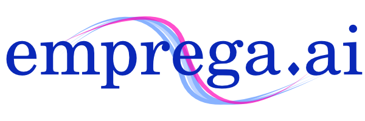

# Emprega.ai - Mobile

 Emprega.ai versão mobile, desenvolvida durante o segundo Hackathon CCR.

### Sobre a solução:

Durante o Hackathon desenvolvemos uma solução que visa trazer oportunidades de emprego e estagio para estudantes de ensino médio e universitários com alguma vulnerabilidade social. Nossa solução visa reduzir a distância entre a empresa e potenciais estagiários, jovens aprendizes ou empregados. Como medida de melhorar a combinatória de currículos para vagas, incluímos as pretensões dos candidatos que serão utilizadas pelos entrevistadores para seleção. A solução é um aplicativo que visa possibilitar capacitação de jovens nas áreas que eles tem maior afinidade.

### Como rodar:
Executar uma vez para instalar as dependências:
```
yarn install
```

Executar o Metro Bundler:
```
npx react-native start
```

Compilar e executar o código em um emulador/dispositivo:
```
npx react-native run-android #Android
```
```
npx react-native run-ios #iOS
``` 
### Funcionalidades

- [x] Cadastro de aluno e seu perfil.
- [x] Cadastro de empresa.
- [x] Adicionar um curriculo a um aluno.
- [x] Adicionar pretensões a um curriculo.
- [x] Mostrar empresas interessadas para aluno.
- [x] Perfis de alunos e sua pretensão.
- [x] Blogs com noticias e dicas para os alunos.

### Tecnologias Utilizadas

A tecnologia escolhida foi [React Native](https://reactnative.dev/), que é uma forma de programar para mobile englobando tanto usuarios IOS quanto para android, além de ser um tecnologia recente e com uma grande comunidade ativa.

### Repositórios

No desenvolvimento dessa solução dividimos em 3 repositórios sendo um repositório para a API, um repositório para o Mobile(frontend) e um repositório para a documentação produzida no evento. Os links se encontram abaixo:

[API](https://github.com/GianMantuan/hackathon-ccr-api) | [FrontEnd](https://github.com/GianMantuan/hackathon-ccr-mobile) | [Documentação](https://github.com/GianMantuan/hackathon-ccr-documentation)

### Colaboradores

[GianMantuan](https://github.com/GianMantuan) - <b>Gian Carlo Mantuan Dala Rosa <<giancarlo.mdr@gmail.com>>

[RicardoFedrigo](https://github.com/RicardoFedrigo) - <b>Ricardo Fedrigo  <<ricardofedrigo1995@gmail.com>> 

[Monegat](https://github.com/Monegat) - <b>Andre Lucas Monegat Costa <<andre@monegat.com.br>>

[CalebedcLuz](https://github.com/CalebedcLuz)- Calebe de Carvalho Luz <<calebedcluz@gmail.com>>

### Licença

Este software foi desenvolvido sob licença [Apache v2](https://www.apache.org/licenses/LICENSE-2.0)


